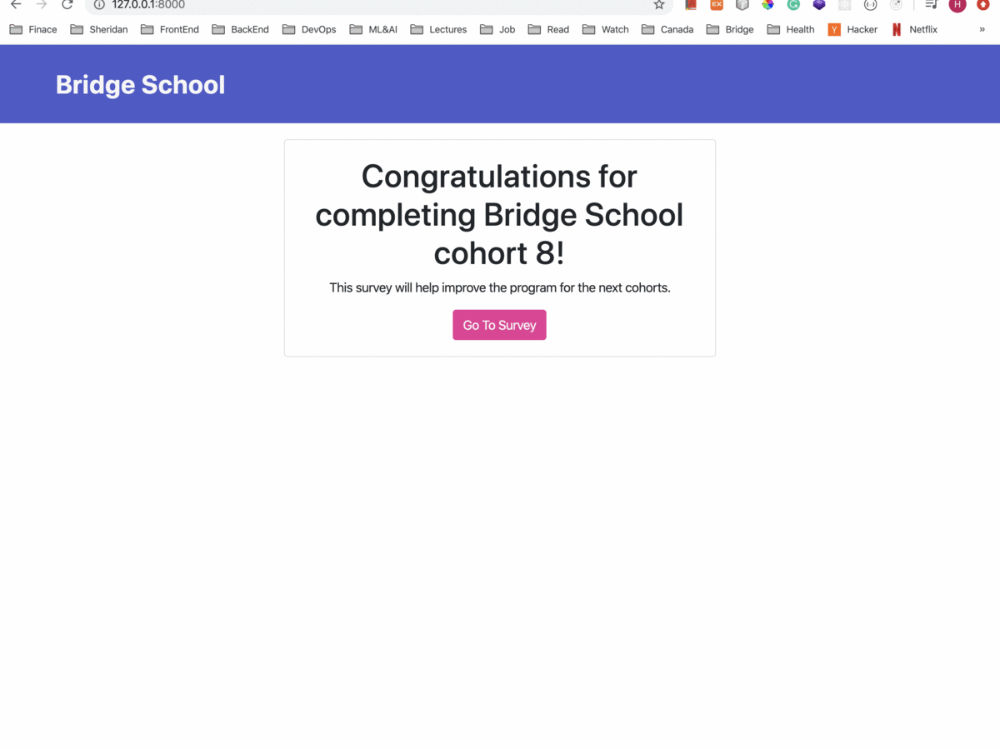

# EZ Polling (Built with Python and Django)

# Overview

Bridge School always does their surveys at the end of each cohort. 

# Purpose

I created an EZ Polling web application which will allow an administrator from Bridge School to create survey questions and view the survey results. Students can vote from the student view page.

# Functionalities:

**1. Different view pages for students and the administrator :**  
    Added the admin's email and password to make sure only admins can reach the admin page 

**2.  Add questions:**  
    Able to add questions on the admin page

**3. Edit and delete questions:**  
    Able to edit and delete questions on the admin page

**4. Vote**  
    Students can select their answers for each question

**5. Display result:**  
    Students and administrators are both able to see results

**6. Display result chart:**  
    Results are shown using a bar chart

# How to run

**\# Install dependencies** 
pipenv install

cd ez_polling 

**\# Serve on localhost:8000** 
python manage.py runserver
